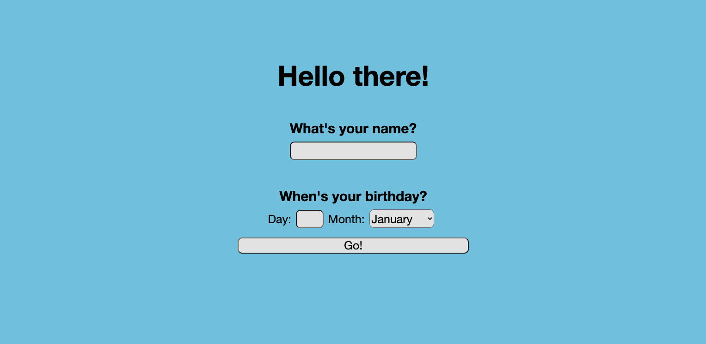
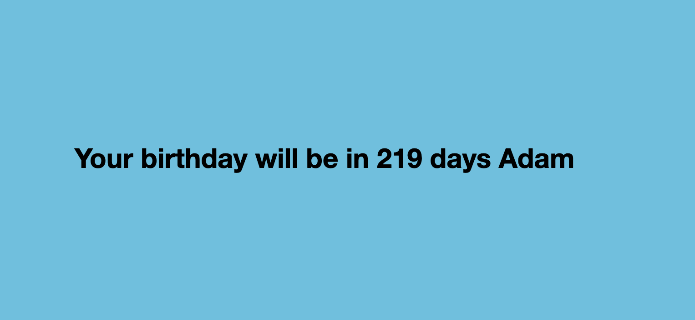

# Birthday App 🎂

  

Find out how long it is until your birthday!

Learning TDD and feature testing using Capybara and building web applications using Ruby, Sinatra, HTML and CSS

## dependencies

- `capybara`
- `rspec`
- `shotgun`
- `sinatra`

## Testing

Run RSpec from root folder
- `rspec`

## Getting started

Clone this repository

`git clone git@github.com:AJ8GH/birthday-app.git`

cd into root folder

`cd birthday-app`

Install dependencies

`bundle install`

Run the app using shotgun

`shotgun config.ru -p 4567`

Or with ruby

`ruby app.rb`

Go to the localhost address in your browser

http://localhost/4567/

## Usage

Enter your details

Find out how many days to go

Or enjoy your birthday greeting!

